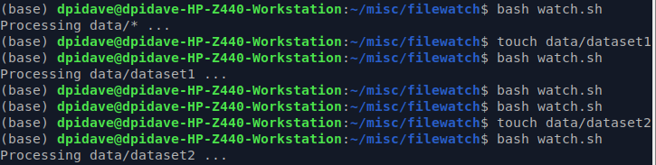

# watch_directory  

just a simple script for watching a directory and processing
any new files.

Saves the file log to `/var/tmp` which typically will be cleaned up
after 30days if it is not touched within that timeframe.  

## Details  
1. Set the WATCHDIR variable for the directory you wish to watch.  
2. Uncomment and add the path to your base-calling script.  
3. Add this as a cron job, requires +x and list full path in `crontab -e`
